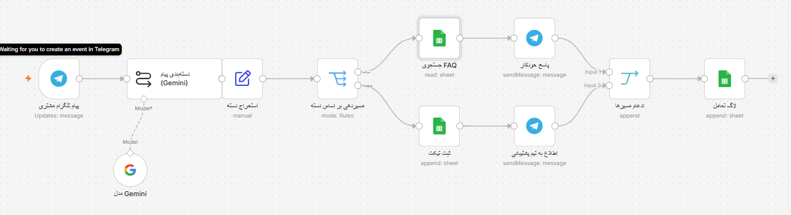

# AI Support Automation (n8n Workflow)

An n8n workflow to automate customer support using Google Gemini (or Groq) and Telegram.

## Features
- **Telegram Trigger:** Listens for customer messages.
- **AI Classification:** Uses Gemini 1.5 Flash to categorize messages (Technical, Financial, General).
- **Smart Routing:**
  - **Simple/General:** Auto-replies using a Google Sheets FAQ.
  - **Complex/Financial:** Creates a ticket in Google Sheets and alerts the support team on Telegram.
- **Logging:** Saves all interactions to Google Sheets.

## Setup
1. **Import:** Upload `ai-support-automation.json` into n8n.
2. **Credentials:** Configure Telegram, Google Gemini API, and Google Sheets.
3. **Config:** Update the `YOUR_SUPPORT_TEAM_GROUP_ID` in the Telegram node and select your Google Sheet.

## License
MIT